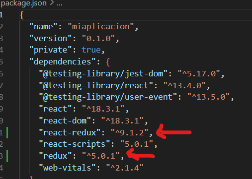

# CHECKPOINT 19

1. [¿Qué es Heroku?](#qué-es-heroku)
2. [¿Qué es Redux?](#qué-es-redux)
3. [¿Qué es HOC?](#qué-es-hoc)


## <span id="qué-es-heroku" style="color: rgba(152, 160, 246, 0.8);">¿QUÉ ES HEROKU?</span> [](image.png)

Heroku es una plataforma como servicio (PaaS), que nos permite **desplegar**, es decir subir y alojar, nuestros proyectos en la nube y usarlo como un servidor para publicar dichos proyectos o aplicaciones en internet haciéndolos así públicamente accesibles y visibles.


><span style="color: rgba(255, 0, 0, 1);">¿Qué es PaaS?</span> PaaS, plataforma como servicio, ofrece un entorno en el que los desarrolladores pueden crear aplicaciones y servicios sin preocuparse por los aspectos de hardware, almacenamiento, redes o sistemas operativos para que esta sea vivible en internet.

Heroku ofrece la posibilidad de crear una conexion entre nuestro servidor de Heroku y nuestro repositorio Github, lo que facilitar el proceso de las actualizaciones de nuestro proyecto, ya que podemos desplegar cambios y fusionarlos de manera casi instantánea.


Los lenguajes que Heroku soporta son:
* Node.js
* Ruby
* Python
* Java
* PHP
* Go 
* Scala
* Clojure

[Saber más sobre Heroku](https://es.wikipedia.org/wiki/Heroku) 📌

Otras alternativas de Heroku:

| **Plataforma**   | **Ventajas**  | **Desventajas** |
|----|----|----|
| [**Render.com**](https://render.com/) | - Plan gratuito para backend, sitios estáticos, y scripts. <br> - Soporta múltiples lenguajes. <br> - Ofrece bases de datos PostgreSQL y Redis. <br> - Protección DDoS incluida. | - Puede ser más complejo que otras opciones para principiantes.            |
| [**Vercel**](https://vercel.com/) | - Ideal para despliegue de aplicaciones front-end y proyectos Next.js. <br> - Despliegue automático en una red Edge. <br> - Soporte para funciones serverless. | - No soporta bases de datos; necesitamos usar otro servicio para ello.      |
| [**Fly.io**](https://fly.io/) | - [CLI](#qué-es-cli) fácil de usar para configuración y despliegue. <br> - Soporta varios lenguajes y bases de datos SQL. <br> - Despliegue de bases de datos fácil desde CLI. | - Bases de datos no son autoadministradas, necesitamos configuración manual. |
| [**Railway.app**](https://railway.app/) | - Plan gratuito con 500 horas de uso al mes. <br> - Soporte para múltiples lenguajes y bases de datos. <br> - Despliegue rápido desde GitHub. | - Límite de horas mensuales puede ser insuficiente para proyectos más grandes. |

><span style="color: rgba(255, 0, 0, 1);">¿Qué es CLI?</span> Interfaz de la linea de comandos, es un tipo de interfaz de usuario de computadora que permite a los usuarios dar instrucciones a algún programa informático o al sistema operativo por medio de una línea de texto simple.


## <span id="qué-es-redux"  style="color: rgba(152, 160, 246, 0.8);">¿QUÉ ES REDUX?</span> [](image.png)

Redux es una librería de JavaScript, disponible en [npm.com](https://www.npmjs.com/package/react-redux), que permite la **gestión del estado global** de nuestra aplicación de manera más eficiente y predecible.
Redux es muy util para proyectos grandes y complejos, donde varios componentes necesitan tener y gestionar el mismo estado. Su funcionalidad nos permite almacenar el estado de nuestra applicación en un solo **árbol de estado**(store), lo que nos facilita su seguimiento y depuración.

Para poder utilizar Redux en nuestra app debemos instalar sus dependencias con el siguiente código:
```javascript
# si usamos npm:
npm install react-redux redux

# si usamos yarn:
yarn add react-redux redux
```

### Los 3 componentes básicos de Redux y cómo se conectan para llevar a cabo toda la función:

1. *Store*: es el objeto de estado donde se guarda todo el estado de nuestra aplicación y facilita su gestión.
2. *Acciones*: son los objetos de JavaScript, mendiante los cuales mandamos información de actualizaciones sobre el estado a store, y este decide cómo actualizarlo.
3. *Reducers*: son las funciones encargadas de decidir cómo se debe actualizar el estado en respuesta a una acción.

<p style="text-align: center;">
  
</p>

Debido a la complejidad de uso de Redux, es importante reconocer que no siempre es aconsejable utilizarlo. No deberíamos adoptarlo simplemente porque es popular o porque otros lo consideran útil, sino porque estamos seguros de que esta herramienta mejorará nuestra aplicación en lugar de complicar su desarrollo. Para tomar una decisión, debemos considerar sus pros y sus contras:

#### ¿Cuándo es recomendable usar Redux?

1. Cuando necesitamos un estado en muchos componentes de nuestra aplicación.

2. Cuando el estado de nuestra aplicación cambia de forma frecuente.

3. Cuando la actualización del estado tiene una lógica compleja.

4. Cuando tenemos una aplicación grande y compleja.

5. Cuando varios desarrolladores trabajen en el mismo proyecto.

6. Cuando necesitamos saber cómo se actualiza ese estado a lo largo del tiempo.

#### ¿Cuándo no es recomendable usar Redux?

1. Sobrecarga en aplicaciones pequeñas: Para aplicaciones simples, Redux puede agregar una complejidad innecesaria, haciendo que el código sea más difícil de manejar.

2. Curva de aprendizaje: Redux tiene una curva de aprendizaje considerable. Los desarrolladores deben comprender bien conceptos y actualizarse constantemente.

3. Verbosidad: Esto puede hacer que la base de código sea más extensa y difícil de leer.

4. Rendimiento: Redux puede causar problemas de rendimiento, especialmente en grandes aplicaciones donde se desencadenan muchas acciones y cambios de estado.


En resumen, Redux es una gran herramienta para manejar el estado de nuestras apliaciones React, especialmente en aquellas que son grandes o tienen un estado complejo. Sin embargo, tenemos que usarlo con precaución y sólo cuando sepamos que realmente es necesario usarlo, ya que podemos darle complejidad innecesaria a aplicaciones más simples.

Para crear un proyecto React con Redux los pasos y los archivos necesarios son los siguientes:

#### EJEMPLO 1:

1. Crear el repositorio React que lo vamos a llamar miaplicacion (el nombre del repositorio debe ser en minúsculas)

```
npx create-react-app miaplicacion
```

2. Accedemos al repositorio de nuestra aplicación:

```
cd miaplicacion
```
<p style="text-align: center;">
  
</p>

3. Instalamos redux y react-redux dentro del repositorio, y se actualizarán las dependencias de nuestros archivos package.json y package-lock.json

```
npm install redux react-redux
```
<p style="text-align: center;">
  
</p>

4. En nuestro archivo App.js creamos nuestra función, que en este caso vamos a poner un ejemplo sencillo en el que crearemos 2 botones, los cuales al presionar incrementarán o decrementarán el valor inicial respectivamente. 

```javascript
import React from 'react';
import './index.css';
import { useSelector, useDispatch } from 'react-redux'; // importamos los hooks de react-redux
import { incNum, decNum } from './actions/index'; // importamos las acciones que vamos a crear

function App() {
	const mystate = useSelector((state) => state.change); // creamos variable llamada mystate, que nos servirá para acceder a nuestro estado mediante el hook useSelector(), y actualizarlo
	const dispatch = useDispatch(); // usamos la variable dispatch, para llevar a cabo la funcion useDispatch() que definiremos más adelante
	return (
		<>
			<h2>Increment/Decrement the number by 2, using Redux.</h2>
			<div className="app">
				<h1>{mystate}</h1>
                /* usamos dispatch, al cual pasamos la función que queramos en cada botón */
				<button onClick={() => dispatch(incNum())}>+</button> 
				<button onClick={() => dispatch(decNum())}>-</button>
			</div>
		</>
	);
}

export default App;

```

5. Creamos las 2 funciones tipo flecha, y les damos el type adecuado para poder usarlo en nuestro reducers:

```javascript
export const incNum = () => { // creamos función llamada incNum
	return { type: "INCREMENT" }
}

export const decNum = () => {
	return { type: "DECREMENT" } // creamos función llamada decNum
}

```

6. Creamos nuestros reducers, que son básicamente los pasos que debe dar nuestra aplicación cuando se llame a las acciones INCREMENT Y DECREMENT. En nuestro ejemplo definimos que cuando se llame a dichas acciones queremos sumar 2 y restar 2 respectivamente.

```javascript
const initialState = 0; // damos un initial state

const change = (state = initialState, action) => { // creamos nuestra función, al que pasamos 2 argumentos, el primero es el state que se iguala a initialState para decir que empezaremos en 0, y el segundo argumento es la action, que nos dice qué tipo de accion queremos llevar a cabo con el estado
	switch (action.type) { // en nuestro caso, como habiamos creado las funciones incNum y decNum, y les habiamos dado un type, los usamos para pasarlos como argumentos
		case 'INCREMENT': // y en caso de que action.type sea = a "INCREMENT"
			return state + 2; // decimos que al state sumaremos 2
		case 'DECREMENT': // y en caso de que action.type sea = a "DECREMENT"
			if (state == 0) { // si el state llega a 0
				return state; // lo dejamos en 0, es decir no queremos llegar a números negativos
			}
			return state - 2; // en caso contrario, restaremos -2
		default:
			return state; // y devolvemos el estado actualizado
	}
};

export default change;
```

7. Debemos saber que para que Redux funcione, tenemos que tener un archivo llamado store.js donde ir guardando nuestros reducers.

```javascript
import change from './func'
import { combineReducers } from 'redux'; // importamos {combineReducer} para cuando tengamos más de un reducer

const rootReducer = combineReducers({
	change // nuestro reducer
});

export default rootReducer;

```

#### EJEMPLO 2: 

Visita mi repositorio [Github](https://github.com/alharuty/ColorChangerWithRedux.git) donde encontrarás otro ejemplo claro. Puedes descargarlo en tu ordenador y mediante el terminal y los siguientes comandos ponerlo en marcha y ver su funcionalidad:

1. ```npm install```
2. ```npm start```

[ColorChangerWithRedux](https://github.com/alharuty/ColorChangerWithRedux.git)📌


## <span id="qué-es-hoc" style="color: rgba(152, 160, 246, 0.8);">¿QUÉ ES HOC?</span> [](image.png)

HOC, Higher Order Component en inglés, es una función que recibe un componente y devuelve otro componente con funcionalidades adicionales. Su función es reutilizar la lógica de los componentes existentes y evitar código repetitivo.

Su sintaxis es:

1. Creamos la funcion Hoc, llamada FuncionHoc
```javascript
const FuncionHoc = (FuncionAMejorar) => { 
    /* código restante*/
}
```
2. Lo llamamos y lo guardamos en una nueva variable para poder usarlo más tarde

```javascript
const FuncionActualizada = FuncionHoc(FuncionAMejorar);
```

3.  La llamamos en cualquier parte de nuestro código

```javascript
<FuncionActualizada />
```

#### ¿Cuándo es recomendable usar HOC?

1. *Autenticaciones*: Cuando tengamos que decidir qué rutas de nuestra aplicación van a necesitar un extra de protección mediante autenticaciones, en vez de crear varios componentes que verifiquen el estado del usuario, podemos crear un HOC y manjearlo de froma más sencilla.
2. *Registro de actividades*: cuando necesitamos registrar eventos o cambios en ciertos componentes para propósitos de depuración o monitoreo.
3. *Reutilización de estilos*: Aplicar mismos estilos a varios componentes.


[Información útil 1](https://es.legacy.reactjs.org/docs/higher-order-components.html)📌<br>
[Información útil 2](https://anamartinezaguilar.medium.com/de-las-funciones-de-orden-superior-a-los-higher-order-components-hoc-e7ac2c013231)📌


<p style="text-align: center;">
  FIN
</p>
